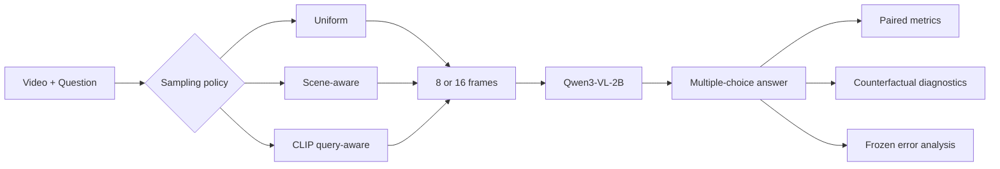

# LongVideoGuard

**Evidence-aware and efficiency-focused VideoQA with Qwen3-VL**

LongVideoGuard is a reproducible VideoQA research project built on **NExT-QA** and **Qwen3-VL-2B-Instruct**. Instead of optimizing a single headline accuracy number, the project studies how multimodal systems behave under limited frame budgets, noisy supervision, visual counterfactuals, dynamic routing, and frozen-set evaluation.

The final engineering conclusion is simple:

> **Uniform-8 offered the strongest frozen accuracy–efficiency trade-off.**  
> It used 47.7% fewer input tokens and reduced model inference latency by 24.4% relative to Uniform-16, while losing only 1.56 percentage points of frozen accuracy.

---

## Highlights

- Built video-level train, holdout, development, and frozen splits to avoid question leakage.
- Verified multimodal SFT batches with assistant-only loss masking.
- Validated LoRA training through gradient checks, parameter deltas, overfitting, save, and reload tests.
- Used swap-video diagnostics to expose text memorization shortcuts.
- Compared Uniform, Scene-aware, and CLIP Query-aware frame sampling under the same eight-frame budget.
- Implemented rule-based and Qwen question routers for dynamic sampling-tool selection.
- Evaluated Question-only, Black-video, Reverse, Shuffle, and Evidence-removal counterfactuals.
- Audited automatically generated hard negatives and found substantial label noise.
- Ran a preregistered 128-question frozen evaluation with Wilson intervals and exact paired McNemar tests.
- Performed final case-level error analysis across all sampling strategies.

---

## System overview



---

## Project stages

### 1. Data pipeline and split design

- Built reusable NExT-QA manifests.
- Enforced video-level separation across:
  - training,
  - holdout,
  - development pilot,
  - frozen evaluation.
- Verified that frozen videos were disjoint from all earlier stages.

### 2. Zero-shot VideoQA baseline

The first Qwen3-VL-2B baseline on the 48-question development pilot achieved:

| Category | Accuracy |
|---|---:|
| Causal | 69.23% |
| Descriptive | 80.00% |
| Temporal | 66.67% |
| **Overall** | **70.83%** |

### 3. Multimodal SFT and LoRA validation

The training pipeline was checked through:

- batch schema inspection,
- `pixel_values_videos` and `video_grid_thw` validation,
- exact prompt-prefix masking,
- assistant-only supervised labels,
- finite forward loss,
- non-zero gradient norms,
- LoRA tensor updates,
- adapter save and reload consistency.

A 16-example overfit experiment reached 100% training accuracy, but swap-video evaluation showed strong text memorization, motivating larger-scale and more rigorous evaluation.

### 4. Larger QA LoRA training

A larger QA-only LoRA experiment used:

- 384 training examples,
- 96 holdout examples,
- 48 development examples.

Training improved the answerability-oriented objective, but did not produce a stable generalization gain over the base model on standard VideoQA.

### 5. Hard-negative data quality audit

Cross-video negatives were introduced to teach structured refusal.

The trained adapter improved:

- valid output structure,
- answerable-status prediction,
- unanswerable recall.

However, a 32-example manual audit found:

- 53.1% clearly unanswerable,
- 28.1% possibly answerable,
- 18.8% actually answerable,
- 46.9% risky negatives overall.

This showed that random cross-video replacement is not a reliable guarantee of unanswerability.

### 6. Frame sampling

Three eight-frame strategies were compared:

1. **Uniform**
2. **Scene-aware**
3. **CLIP Query-aware**

Development results:

| Method | Overall | Causal | Descriptive | Temporal |
|---|---:|---:|---:|---:|
| Uniform-8 | 64.58% | 65.38% | 60.00% | 66.67% |
| Scene-aware-8 | 68.75% | 69.23% | 60.00% | **75.00%** |
| Query-aware-8 | 68.75% | **80.77%** | 50.00% | 58.33% |

Query-aware sampling increased average question–frame similarity, but also increased visual redundancy and reduced temporal coverage.

### 7. Dynamic routing

The routing policy was:

- Causal → Query-aware
- Temporal → Scene-aware
- Descriptive → Uniform

Results:

| Router | Category classification | Routed VideoQA |
|---|---:|---:|
| Rule-based | 68.75% | 66.67% |
| Qwen zero-shot | **75.00%** | **68.75%** |
| Gold-category oracle | 100% | 75.00% |

The deployable Qwen router matched the best fixed strategy, but did not surpass it.

### 8. Counterfactual evaluation

Using Scene-aware-8 as the base condition:

| Condition | Accuracy |
|---|---:|
| Original | **68.75%** |
| Reversed | 66.67% |
| Shuffled | 62.50% |
| Black video | 39.58% |
| Relevant-mask | 66.67% |
| Random-mask | 60.42% |
| Question-only | 43.75% |

Key findings:

- Original exceeded Question-only by **25.0 percentage points**.
- Original exceeded Black-video by **29.2 points**.
- Temporal accuracy dropped by **25 points** after shuffling.
- Temporal accuracy did not drop after complete reversal.
- Masking top-CLIP frames was less harmful than random masking.

The model therefore used visual information, but did not demonstrate reliable directional temporal reasoning. CLIP similarity was also not a faithful evidence-attribution score.

---

## Frozen VideoQA results

The final policy was preregistered before frozen results were inspected.

| Policy | Correct | Accuracy | Mean input tokens | Mean latency | Mean peak GPU memory |
|---|---:|---:|---:|---:|---:|
| Uniform-8 | 87/128 | **67.97%** | 1106.5 | 0.133 s | 4298.7 MB |
| Scene-aware-8 | 85/128 | 66.41% | 1106.5 | 0.126 s | 4298.7 MB |
| Uniform-16 | 89/128 | **69.53%** | 2115.1 | 0.175 s | 4509.9 MB |

None of the paired differences were statistically significant.

| Paired comparison | Accuracy delta | Exact McNemar p |
|---|---:|---:|
| Scene-aware-8 vs Uniform-8 | -1.56 pp | 0.791 |
| Scene-aware-8 vs Uniform-16 | -3.13 pp | 0.388 |
| Uniform-8 vs Uniform-16 | -1.56 pp | 0.774 |

### Accuracy–efficiency conclusion

Relative to Uniform-16, Uniform-8:

- reduced mean input tokens by **47.7%**,
- reduced model inference latency by **24.4%**,
- reduced mean peak GPU memory by approximately **211 MB**,
- lost only **1.56 percentage points** of frozen accuracy.

For deployment, Uniform-8 is the recommended default.

---

## Final error analysis

Across the 128 frozen questions:

| Error bucket | Count |
|---|---:|
| All three correct | 77 |
| All three wrong | 32 |
| Uniform-16 correct, Uniform-8 wrong | 7 |
| Uniform-8 correct, Uniform-16 wrong | 5 |
| Uniform-8 correct, Scene-aware wrong | 8 |
| Scene-aware correct, Uniform-8 wrong | 6 |
| Prediction disagreement | 25 |

Important observations:

- 26 of the 32 persistent failures produced the same wrong answer under all three policies.
- Most persistent errors were therefore not solved by increasing frame count or changing the sampler.
- Temporal questions had the highest prediction-disagreement rate.
- Post-hoc majority vote reached 70.31%, but is reported only as diagnostic analysis.
- The post-hoc “any method correct” upper bound was 75.00%.

---

## Main conclusions

1. **More frames were not universally better.**
2. **More sophisticated retrieval was not universally better.**
3. **Uniform-8 provided the strongest frozen accuracy–efficiency trade-off.**
4. **The model genuinely used video evidence, but still relied on language priors.**
5. **Temporal continuity mattered more than complete directional ordering.**
6. **CLIP relevance was useful for retrieval, but not reliable as evidence attribution.**
7. **Automatic cross-video negative generation introduced substantial label noise.**
8. **Frozen evaluation changed the engineering recommendation, which is exactly why frozen evaluation matters.**

---

## Repository structure

```text
src/longvideoguard/
├── analysis/
├── demo/
├── evaluation/
├── retrieval/
├── routing/
└── training/

scripts/
tests/
docs/
streamlit_app.py
```

---

## Quick start

```bash
git clone <YOUR_REPOSITORY_URL>
cd LongVideoGuard

pip install -r requirements-stage9c.txt
pip install -e .
```

Run tests:

```bash
pytest -q
```

Launch the Streamlit demo:

```bash
python scripts/run_streamlit_demo.py
```

Open:

```text
http://localhost:8501
```

---

## Reproduce major experiments

```bash
# Sampling evaluation
python scripts/evaluate_stage7_sampling.py ...

# Question router
python scripts/evaluate_stage7_question_router.py ...

# Counterfactual evaluation
python scripts/evaluate_stage7_counterfactuals.py ...

# Frozen evaluation
python scripts/evaluate_stage8_frozen_videoqa.py ...

# Final error analysis
python scripts/analyze_stage9_final_errors.py ...

# Final report
python scripts/build_stage9_final_report.py ...
```

---

## Limitations

- The frozen set contains 128 questions, so confidence intervals remain wide.
- The project uses Qwen3-VL-2B rather than a larger production-scale VLM.
- Query-aware retrieval used CLIP question–frame similarity without answer-option conditioning.
- Counterfactual black-frame and masking inputs are partly out of distribution.
- The automatic hard-negative generator was not reliable enough for final benchmarking.
- The deployment latency numbers measure model inference after frame preprocessing, not full end-to-end latency.

---

## Future work

- Train an evidence-aware frame scorer using answer-conditioned supervision.
- Add temporal position encoding to the retrieval stage.
- Evaluate larger VLM backbones.
- Build a learned router using held-out question categories and retrieval-cost targets.
- Replace synthetic cross-video negatives with verified or adversarially mined negatives.
- Evaluate on longer videos and additional VideoQA datasets.
